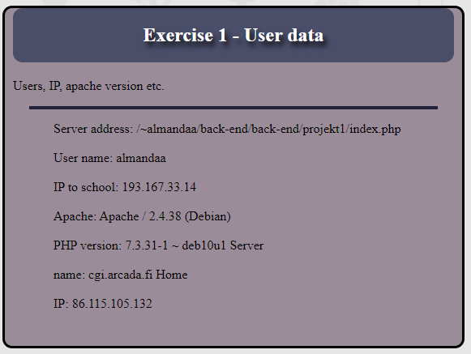
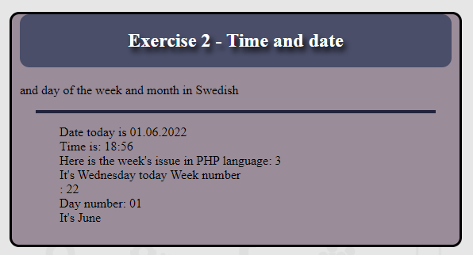
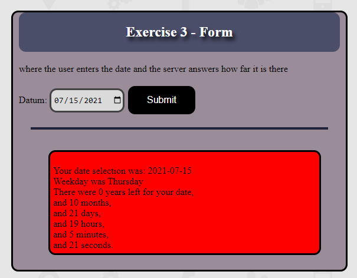
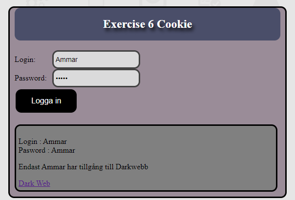

# Social Networking Application with PHP

This PHP-based social networking application offers a feature-rich and secure online experience. Explore the key functionalities below:

## User Authentication and Registration

Users can securely create accounts and log in, with PHP managing authentication and storing user details in a database.

## User Profiles

Dynamic user profiles display personal information, posts, and relevant data, with PHP handling data retrieval and display.

## Friends System

Enable users to send and receive friend requests, with PHP managing the friend request process and updating friend lists accordingly.

## News Feed

The main page features a personalized news feed displaying posts from the user's friends. PHP organizes and retrieves content from the database.

## Posting and Sharing Content

Users can create posts, share multimedia content, and links, with PHP handling submission and storage in the database.

## Real-Time Notifications

Utilize PHP, along with technologies like AJAX or WebSocket, to implement real-time notifications for user actions such as likes, comments, and friend requests.

## Privacy Settings

Empower users to control the visibility of their posts and profile information, with PHP managing privacy settings to ensure appropriate content display.

## Messaging System

Incorporate a private messaging system, facilitating the storage and retrieval of messages between users.

## Groups and Events

Allow users to create and participate in groups or events, with PHP managing the creation, organization, and interaction within these spaces.

## Content Moderation

Implement features for content moderation, ensuring user-generated content aligns with community guidelines and standards.

## Security Measures

Prioritize user data protection by implementing secure coding practices, input validation, and data encryption.

## Scalability

Ensure the application's scalability to handle a growing user base, utilizing PHP and a robust database system for optimal performance as user counts increase.

## PHP project 1 description:
## 1. User data:
- Task 1 shows users' (server address, name, IP for the school,
apache, php version, server name and ip to home).
- And all data comes automatically.
- 

##  2. Time and date:
- Task 2 will come (Date, time, week number, day name day number and month name). 
- Everything happens automatically.

- 
## 3. Form:
- The user enters the date and the server responds how far it is there. 
- If it's old date so it will be in a red box, and if it is future date it becomes a green box. 
- It also comes with the number of months, days, timber, minutes and seconds.
- 

## 4.Signup form:
- The server sends a random password in a confirmation email.
- 
## 5. cookies:
- Script that greets returning users and tells dates and wise for the first visit.
- 

## 6. PHP Session:
- A page from the user is hidden here,
but if you set the correct password, you will come to the hidden page.
- Hidden page shows user login name and password,
but if the user has a link to the hidden page without a proper password, there will be a message,
who asks to log in to see the page information.

- Hidden page shows input name and password with some other information.
- There is also an option to press the log off button that closes the information page,
and preventing the user from accessing the hidden page information,
there will also be a red box asking the user to log in again.
- The catchwords for the page are: Breastfeeding.
- 

## 7. Upload image:
- Images are uploaded here with jpg,
 png and jpeg to the server.
- Then you can click on the link to see all the images that are loaded in the server.
- 

## 8. Visitor counter:
- Here the number of visitors is registered with their IP address and date in the server.
- 

## 9. Timer:
- Here comments are stored in the page in a file. And you can see them through a link.
- 

