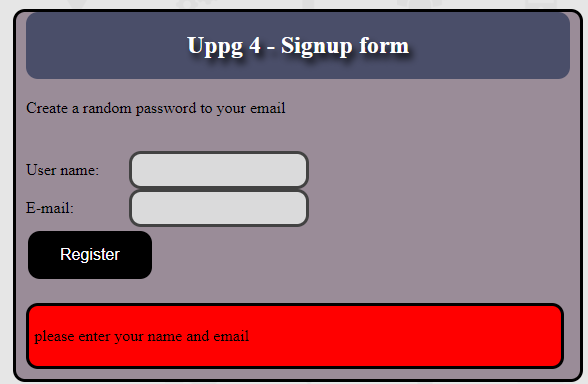
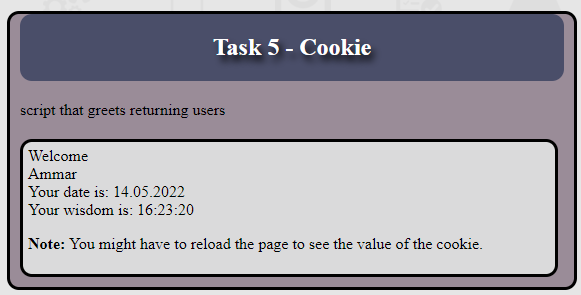
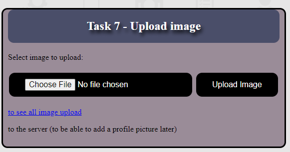
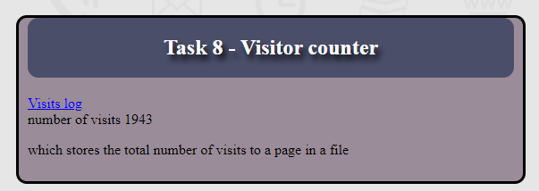
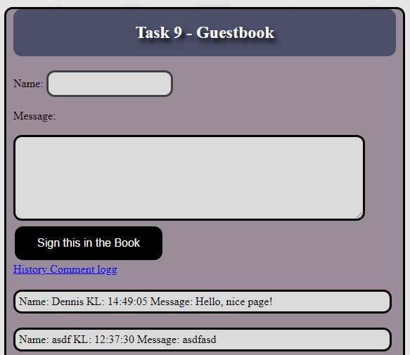

# PHP project 1 description:
## 1. User data:
- Task 1 shows users' (server address, name, IP for the school,
apache, php version, server name and ip to home).
- And all data comes automatically.

##  2. Time and date:
- Task 2 will come (Date, time, week number,
day name day number and month name). Everything happens automatically.

## 3. Form:
- The user enters the date and the server responds
how far it is there. If it's old date
so it will be in a red box, and if it is future date
it becomes a green box. It also comes with the number of months, days, timber, minutes and seconds.

## 4.Signup form:
- The server sends a random password in a confirmation email.

## 5. cookies:
- Script that greets returning users and tells dates and wise for the first visit.

## 6. PHP Session:
- A page from the user is hidden here,
but if you set the correct password, you will come to the hidden page.
- Hidden page shows user login name and password,
but if the user has a link to the hidden page without a proper password, there will be a message,
who asks to log in to see the page information.

- Hidden page shows input name and password with some other information.
- There is also an option to press the log off button that closes the information page,
and preventing the user from accessing the hidden page information,
there will also be a red box asking the user to log in again.

The catchwords for the page are: Breastfeeding.

## 7. Upload image:
- Only pictures with me are uploaded here,
png and jpeg format to the server.
then you can click on the link to see all the images that are loaded in the server.

## 8. Visitor counter:
- Here, the total number of visits to a page in a file is loaded.
other things are also registered, such as the visitor's IP addresses and time of visit.

## 9. Timer:
- Here comments are stored in the top page of a file. You can also see them through a link.

